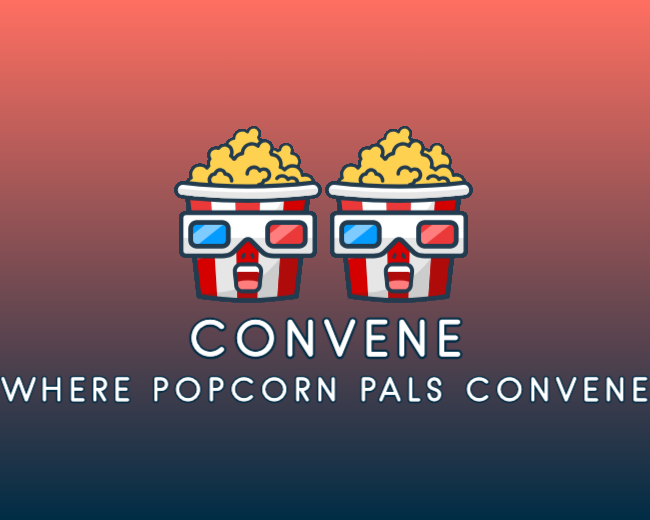
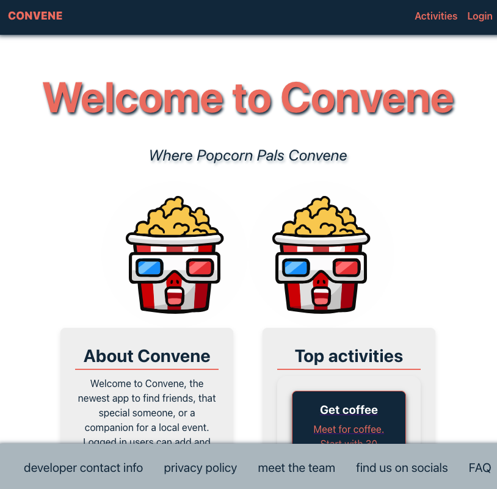
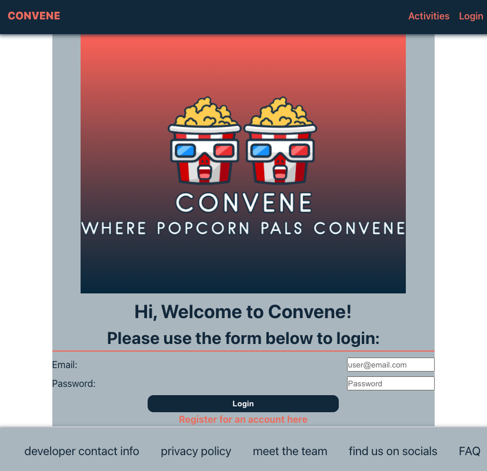
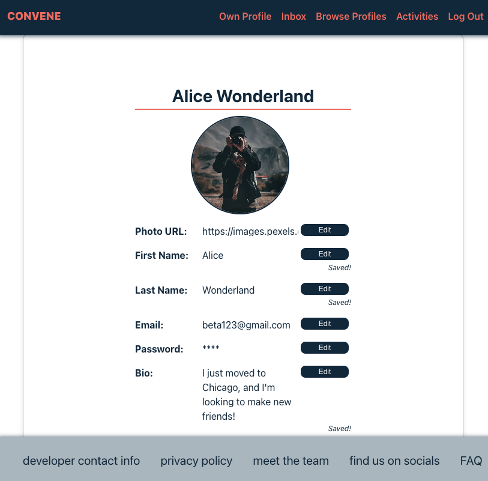
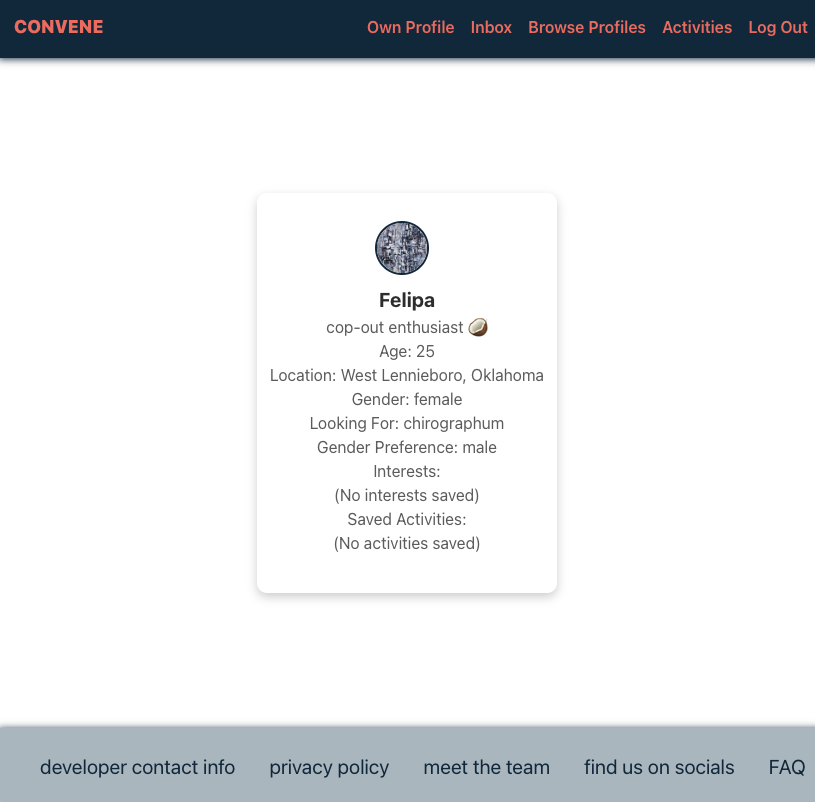
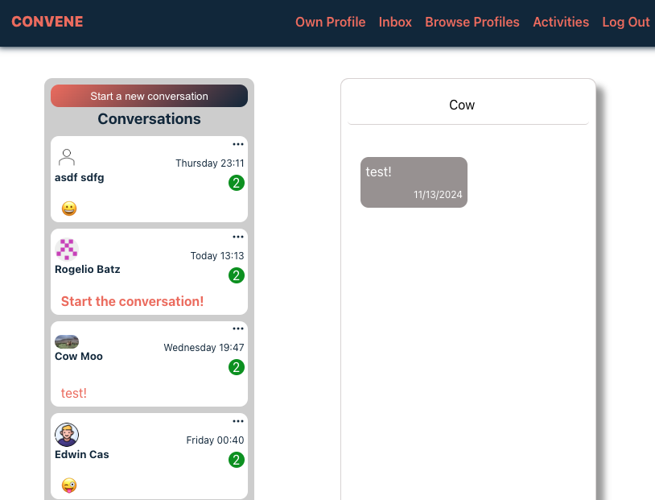
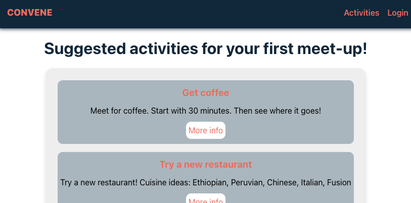
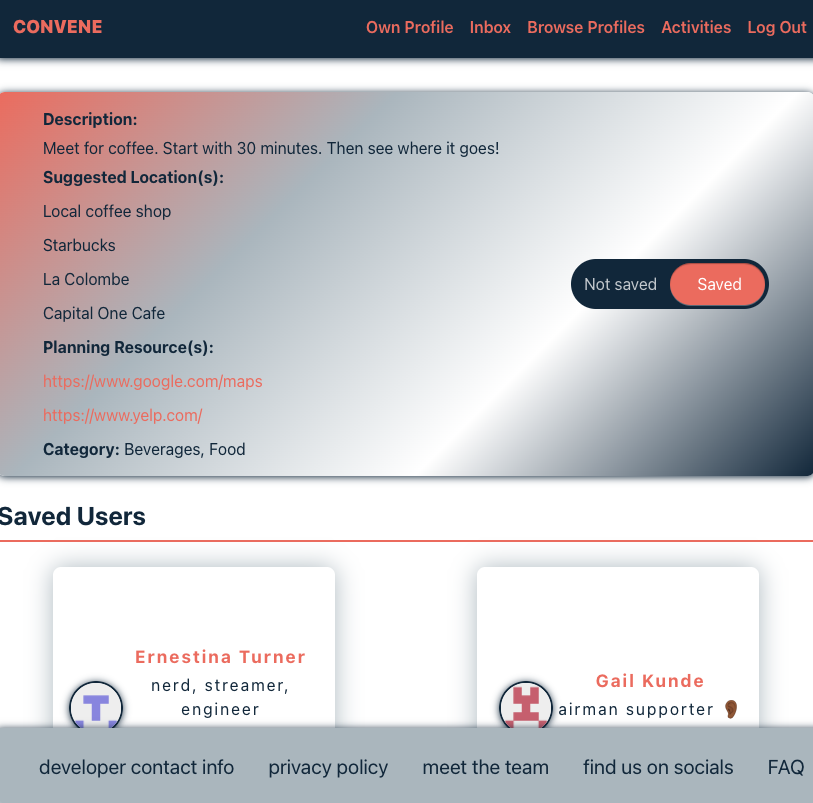

# Convene App

Welcome to Convene, the newest app to find friends, that special someone, or a companion for a local event. Logged in users can add and edit information about themselves, add their interests, create a list of other liked users to connect with, one-to-one chat with other users, and add local activity types they might be interested in attending.

## Getting Started

### Set up the project locally

1. Install Node.js and npm: [Downloading and installing Node.js and npm](https://docs.npmjs.com/downloading-and-installing-node-js-and-npm)
2. Clone the repository locally: `git clone https://github.com/wangbertha/convene-app-frontend.git`
3. Install dependencies: `npm install`

### Set up the corresponding backend

1. Follow the Getting Started instructions in the [Convene App backend repository](https://github.com/wangbertha/convene-app-backend)

### Run the project locally

1. Run the project locally: `npm run dev`
2. Open the following in your browser: `http://localhost:5173/`

## Functionality

### Homepage

Upon loading the home page, the user is greeted with the logo above, as well as a list of activity ideas available. The user can view a list of all activities available before logging in.

### Login

The user can visit the login page to log in with an email and password, or they can click to register for an account with an email, password, and first name.

### Own Profile

After logging in, more options on the navbar are available to the user. The first option is to view their own profile.  The user can customize their profile with a myriad of options, including:

- First name and last name
- A url with a link to a profile picture
- Update their email and password
- Leave a short bio describing themselves
- Update their current city and state
- Provide their age and gender
- Deactivate or delete their account

In order to customize the user's experience on Convene, we offer some ways to help us match them up with someone. They can add additional information about themselves such as:

- Whether they are looking for friends, a romantic partner, or someone to join them in an activity
- They can choose from a list of existing hobbies or interests, or add their own if it is not on the list
- They can also see any activites that they have saved for themselves, and for others to view

### Browse Profiles

The logged in user can browse other profiles on this page. The page will load a random profile, then the user can swipe right to "like" and connect with the profile, or swipe left to "dislike" and not connect.  Once a profile is "liked" or "disliked", they will not show back up on the browse profiles page for the logged in user.

### Inbox (Beta-testing mode)

The logged in user can chat with other users that have connected with each other. The Conversations window shows any conversations that have been started with other users. The user can also create a new conversation with another user if the conversation has not been started yet.

The Chat window shows all the messages in the selected conversation. The user can create new messages here with text and emojis.

This feature is in beta-testing mode.

### Activities

The user can view the list of activity ideas here. A logged in user can add these activities to their profile from here, or click to view more information about the activity.

Each activity page shows a photo relating to the activity, a short description of the activity, some suggested locations, the type of activity, and some planning resources for the given activity.  A list of other users interested in this activity is also shown.  The user can also add the activity to their profile from this page.

### Languages and Libraries Used

Frontend:

- Javascript
- Vite
- React
- React Redux
- Redux Toolkit
- Socket.io Client
- Moment

Backend:

- Javascript
- Prisma
- PostgreSQL
- Express
- Socket.io Server
- Faker
- Node
- bcrypt, jwt